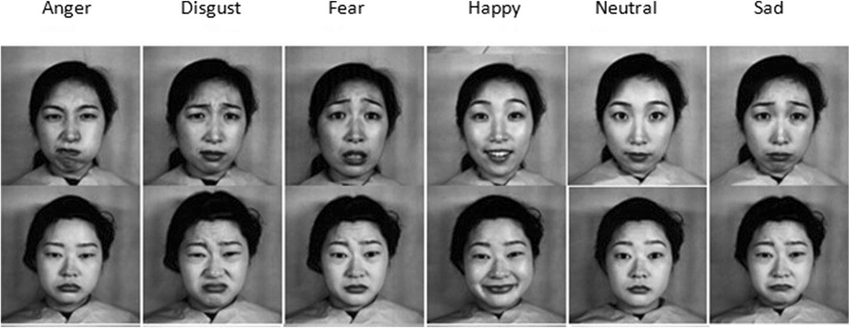

# FACIAL ACTION TRACKING
## Introduction
Facial action tracking is a system that tracks movements of human face, which
uses actions units (AUs) to follow differences between face muscles. It is one of the
technique used to detect human emotions in real-time.
## Dataset
The Japanese Female Facial Expression (JAFFEE) database: The database
contains 213 images of 7 facial expressions (6 basic facial expressions + 1 neutral) po sed
by 10 Japanese female models. Each image has been rated on 6 emotion adjectives by 60
Japanese subjects. This database contains only posed expressions. The photos have been
taken under strict controlled conditions of similar lighting and with the hair tied away
from the face

## Methodology

The system follows five steps:

### Face detection

- Determine coordinate of face in images
- Using available model.

### Facial landmarks detection

Examining the image, we can see that facial regions can be accessed via simple
Python indexing (assuming zero-indexing with Python since the image above is o ne-
indexed):
- The mouth can be accessed through points [48, 68].
- The right eyebrow through points [17, 22].
- The left eyebrow through points [22, 27].
- The right eye using [36, 42].
- The left eye with [42, 48].
- The nose using [27, 35].
- And the jaw via [0, 17].

### Facial features detection

- Upper facial features detection

- Lower facial features detection

### Facial motion tracking
Motion of upper facial features comparing between new frame and old frame:
- Change in Distance between eyebrows.
- Change in height between outer corner of left eye and outer left eyebrow, of
right eye and outer right eyebrow.
- Change in height between inner corner of left eye and inner left eyebrow, of
right eye and inner right eyebrow.
- Change in height of top left and top right eyelid from pupil.
- Change in height of bottom left and bottom right eyelid from pupil.
- Change in height of bottom left eyelid and right eyelid from pupil.
- Change in left and right eye height.
- Change in density of lines from canny edges between brows.
- Change in density left of left eye and right of right eye.
- Change in distance from top left and top right eyebrow to brim of nose.
- Change in height from brim of nose to corner of nose.
- Change in height of left eye and right eye from eyelid to eyelid.

Motion of lower facial features comparing between new frame and old frame:
- Change in lip height and width.
- Change in height of left lip and right lip corner to nose.
- Change in height of top and bottom lip to bridge of nose.

### Action units detection using support vector machine (SVM)
This system uses two models SVM to detect upper AUs and lower AUs.

**Why SVM?**
- Provides high accuracy, suitable for small and medium data sets.
- **Accuracy score of SVM vs Gaussian Naive Bayes and Decision Tree Classifier with 80% train set and 20% test set**:
    - Accuracy score of SVM for upper facial features: 0.4032258064516129
    - Accuracy score of SVM for upper facial features: 0.43243243243243246
    - Accuracy score of Naive bayes for upper facial features: 0.3467741935483871
    - Accuracy score of Naive bayes for upper facial features: 0.35135135135135137
    - Accuracy score of Tree for upper facial features: 0.1532258064516129
    - Accuracy score of Tree for upper facial features: 0.3783783783783784

SVM model receives input with facial emotion as features as above and the
corresponding AUs as labels.

### Evaluate
The model only recognizes the lower Aus. Therefore the model only recognizes surprise, sad emotions.

The remaining emotions are difficult to recognizes.

## Limitations
- System can recognize 6 basic emotions while human emotions are diverse.
- Depends on clear expression of humans.
- Depends on neutral image to compare.
- Difficulty in getting suitable database.

## Improvements
- Find suitable database for recognition of action units.
- Convert the model into a sequence of image for comparison.

## References
1. Lyons, Michael, Kamachi, Miyuki and Gyoba, Jiro. zenodo.org. [Online] 4 14, 1998. https://zenodo.org/record/3451524#.Xtcn-FUzbIU.
2. Rosebrock, Adrian. pyimagesearch.com. [Online] 4 3, 2017. [Cited: 6 3, 2020.] https://www.pyimagesearch.com/2017/04/03/facial-landmarks-dlib-opencv-python/.
3. Ying-li Tian, Takeo Kanade, Jeffrey F. Cohn. [Online] https://www.ncbi.nlm.nih.gov/pmc/articles/PMC4157835/figure/F9/.
4. —. [Online] https://www.ncbi.nlm.nih.gov/pmc/articles/PMC4157835/figure/F10/.
5. wikipedia. wikipedia.com. [Online] https://en.wikipedia.org/wiki/Facial_Action_Coding_System.
6. Happy Bot. stein, joshlam. 
